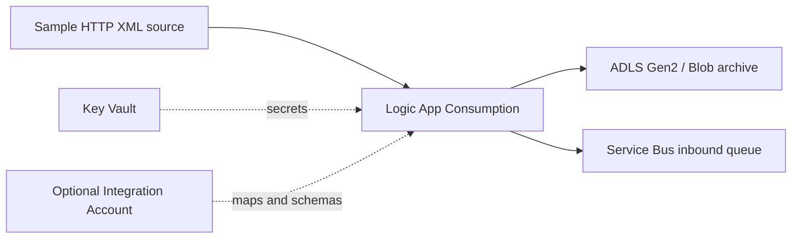

# Azure ETL and Enterprise Integration Modernization Accelerator

This repository is a vendor-neutral starting point for discovering, assessing, and modernizing ETL, EAI, B2B, API, file-transfer, and messaging workloads on Azure. It combines a deployable Azure Integration Services baseline with guidance for planning migration waves from heterogeneous integration estates.

Source-platform examples cover **Informatica**, **TIBCO**, **MuleSoft**, **Oracle Integration Cloud and OCI integration services**, **IBM Integration Bus / App Connect Enterprise**, **SAP PI/PO**, and **BizTalk Server**. The source platform informs discovery and decomposition; it does not prescribe a one-to-one product replacement.

> This accelerator provides infrastructure and a small working integration flow. It does not include executable discovery scanners, source-product parsers, or migration adapters. Validate connector availability, semantics, security, performance, and cost for each workload.

## Start here

1. Review the [architecture](docs/architecture.md) to distinguish the deployed baseline from optional target-state services.
2. Use the [assessment and migration guide](docs/assessment-and-migration.md) to build an inventory, score complexity, and plan waves.
3. Use the [source-to-Azure capability mapping](docs/source-platform-mapping.md) as a hypothesis for design workshops, not an automated conversion specification.
4. Deploy the baseline and replace the sample contract, routing, and security choices with workload-specific implementations.

## What the baseline deploys

| Resource | Implemented behavior |
| --- | --- |
| Logic Apps Consumption | HTTP-triggered sample accepts XML, writes it to Blob storage, sends it to a Service Bus queue, and returns a correlation ID. |
| Service Bus Basic | Creates `inbound`, `outbound`, and `errors` queues plus a development authorization rule. |
| Storage account | Enables ADLS Gen2 hierarchical namespace, creates `xml-store` and `audit` containers, and creates `drop` and `pickup` Azure Files shares. |
| Integration Account | Optionally creates an account for schemas and maps. A Liquid XML-to-JSON sample is included in the repository and can be uploaded with the provided tool. |
| Key Vault | Stores the generated Storage account name/key and Service Bus connection string. |
| Log Analytics | Creates a workspace for later diagnostic settings and operational queries. |
| Networking | Optionally creates a VNet, workload subnets, private endpoints for Blob, File, and Key Vault, and matching private DNS zones. |

The template does **not** deploy API Management, Data Factory, Fabric Data Factory, Azure Functions, Event Grid, Event Hubs, self-hosted integration runtimes, source-system connectors, diagnostic settings, Service Bus private endpoints, or production identity/RBAC configuration. These are extension choices described in the architecture.

## Reference flow



The sample demonstrates a reusable **receive -> correlate -> persist -> queue** pattern. It is intentionally source-neutral: a migration team can place an API facade, file landing zone, source connector, or hybrid bridge ahead of the workflow without claiming that the original platform can be converted automatically.

## Modernization lifecycle

| Phase | Outcome |
| --- | --- |
| Discover | Inventory interfaces, schedules, dependencies, contracts, adapters/connectors, custom code, SLAs, owners, volumes, security boundaries, and operational history. |
| Assess | Classify each workload as retire, retain, rehost temporarily, replatform, refactor, or replace; record evidence and unknowns. |
| Design | Select Azure capabilities by required behavior: orchestration, data movement, messaging, API management, transformation, B2B, eventing, compute, and observability. |
| Pilot | Prove representative contracts and failure modes with production-like volume, identity, networking, replay, and reconciliation. |
| Migrate | Deliver dependency-aware waves with coexistence, cutover, rollback, and business acceptance criteria. |
| Optimize | Remove temporary bridges, adopt managed identity and least privilege, tune cost/performance, and decommission the source only after evidence-based exit gates pass. |

## Capability-led mapping

Avoid translating product names directly. Decompose each workload into capabilities and select a target per requirement.

| Required capability | Common Azure candidates | Decision factors |
| --- | --- | --- |
| Workflow and stateful orchestration | Logic Apps Standard or Consumption, Durable Functions | State duration, connector model, isolation, throughput, code needs, deployment topology |
| Batch ETL / ELT and data movement | Azure Data Factory or Fabric Data Factory, Databricks, Functions | Data gravity, transformation engine, scheduling, scale, lineage, team skills |
| Reliable queues and publish/subscribe | Service Bus | Ordering, sessions, duplicate detection, transactions, throughput, private networking |
| Streaming and telemetry ingestion | Event Hubs | Partitioning, retention, consumer groups, event volume |
| API mediation and governance | API Management | Authentication, throttling, policy, lifecycle, internal/external exposure |
| File and lake landing zones | Azure Storage / ADLS Gen2 | Protocol, hierarchy, lifecycle, encryption, private access |
| B2B artifacts and EDI processing | Logic Apps and Integration Account | Trading partners, agreements, schemas, acknowledgements, certification requirements |
| Custom transformations or protocol bridges | Azure Functions, Container Apps, custom services | Runtime/library support, latency, scaling, ownership, supportability |
| Secrets and keys | Key Vault | Managed identity, rotation, certificate lifecycle, network controls |
| Monitoring and operations | Azure Monitor, Application Insights, Log Analytics | Correlation, retention, business tracking, alerting, replay and support workflow |

See [source-platform mapping](docs/source-platform-mapping.md) for discovery prompts specific to each supported source family.

## Migration patterns

- **Strangler migration:** route one interface or consumer at a time to Azure while the source platform remains authoritative for the rest.
- **Landing-zone decoupling:** land files or messages in Storage or Service Bus, then migrate producers and consumers independently.
- **Contract-first replacement:** preserve the externally observable contract while replacing orchestration and transformation behind a controlled facade.
- **Parallel run and reconciliation:** execute old and new paths with masked or controlled data, compare business outcomes, then cut over.
- **Hybrid bridge:** use supported network and protocol connectivity during coexistence; give every bridge an owner and removal criterion.
- **Rebuild instead of translate:** redesign brittle, platform-specific custom code when preserving its implementation would carry the same operational debt forward.

## Source-platform scope

| Source family | Examples to inventory |
| --- | --- |
| Informatica | PowerCenter repositories, mappings, workflows, sessions, parameter files, schedules, connections, pushdown logic |
| TIBCO | BusinessWorks processes, EMS destinations, adapters, schemas, shared resources, Hawk or operational dependencies |
| MuleSoft | Mule applications, flows, connectors, DataWeave, API specifications, policies, CloudHub/runtime topology |
| Oracle | OIC integrations, connections, lookups, schedules, agents, OCI Functions/Streaming/Queue dependencies, SOA Suite coexistence where present |
| IBM | Message flows, ESQL, BAR files, policies, MQ topology, configurable services, IIB/ACE runtime dependencies |
| SAP PI/PO | Integration Directory and Repository objects, channels, mappings, BPM/process orchestration, SLD dependencies |
| BizTalk | Applications, orchestrations, pipelines, maps, schemas, ports, bindings, parties/agreements, BRE, BAM, custom assemblies |

BizTalk-specific diagrams are retained as a single source-platform example: [migration overview](docs/BizTalkToAzure.png) and [reference target state](image.png). They are not the accelerator's general architecture.

## Repository layout

```text
infra/bicep/          Deployable source templates
infra/arm/            Generated ARM artifact and deployment UI definition
integration/maps/     Working Liquid transformation sample
tools/                .NET utilities for Key Vault and Integration Account
docs/                 Architecture, assessment, mapping, naming, and deployment guidance
scripts/powershell/   Existing Bicep-to-ARM build script
```

## Deploy to Azure

### Prerequisites

- An Azure subscription and target resource group
- Permission to deploy resources and create Key Vault access policies in that resource group
- Registered resource providers used by the template: `Microsoft.Logic`, `Microsoft.ServiceBus`, `Microsoft.Storage`, `Microsoft.KeyVault`, `Microsoft.OperationalInsights`, `Microsoft.Web`, and, when networking is enabled, `Microsoft.Network`
- The Microsoft Entra object ID of the development user or group that will administer Key Vault secrets

[](https://portal.azure.com/#create/Microsoft.Template/uri/https%3A%2F%2Fraw.githubusercontent.com%2Ftrajkovicn%2Fais-etl-integration-accelerator%2Fmain%2Finfra%2Farm%2Fazuredeploy.json/createUIDefinitionUri/https%3A%2F%2Fraw.githubusercontent.com%2Ftrajkovicn%2Fais-etl-integration-accelerator%2Fmain%2Finfra%2Farm%2FcreateUiDefinition.json)

For local template compilation and deployment details, see [development deployment](docs/dev-deployment.md). Resource names follow [the documented naming convention](docs/naming-convention.md).

## Extend safely

- Replace shared access keys with managed identity and Azure RBAC where supported by the selected services.
- Add only the connectors and compute needed for a validated migration wave.
- Store source exports and assessment evidence outside the deployed runtime; treat credentials and production payloads as sensitive.
- Add contract tests, replay tests, observability, and reconciliation before production cutover.
- Preserve source-specific behavior only when business or regulatory requirements justify it.
- Price the selected services with measured workload volumes; this repository does not provide a universal savings estimate.

## Utilities

- [Integration Account Uploader](tools/IntegrationAccountUploader/README.md) uploads the included Liquid map to an existing Integration Account.
- [Key Vault Seeder](tools/KeyVaultSeeder/README.md) sets a secret in an existing Key Vault using `DefaultAzureCredential`.

These utilities support the sample and extension work. They do not discover or convert source-platform assets.

## Further reading

- [Azure Integration Services](https://learn.microsoft.com/azure/azure-integration-services/)
- [Choose between Azure messaging services](https://learn.microsoft.com/azure/service-bus-messaging/compare-messaging-services)
- [Azure Architecture Center integration patterns](https://learn.microsoft.com/azure/architecture/guide/architecture-styles/event-driven)
- [BizTalk Server migration approaches](https://learn.microsoft.com/azure/logic-apps/biztalk-server-migration-approaches)
