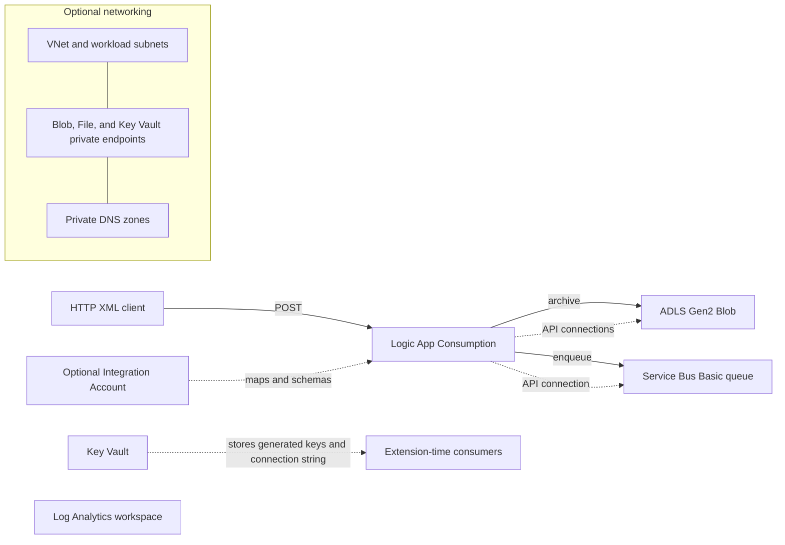
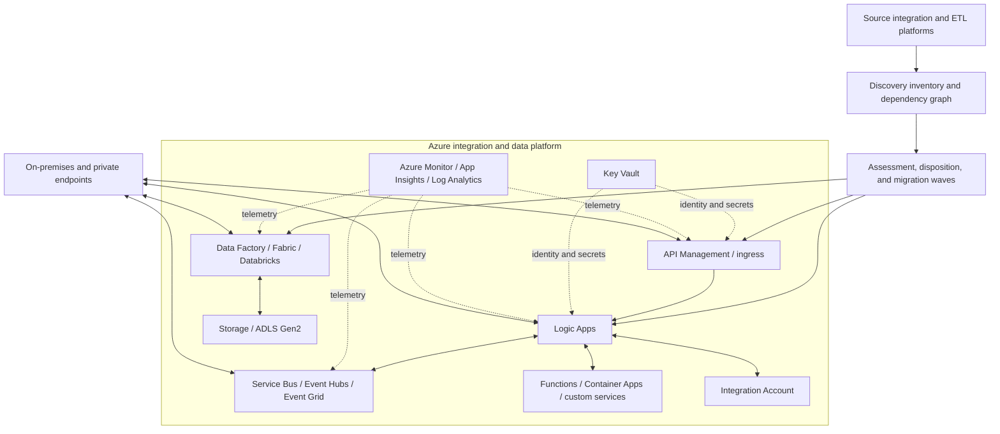

# Architecture

The accelerator separates a small, deployable Azure Integration Services baseline from the broader target architecture that a modernization program may require. This prevents an infrastructure sample from being mistaken for a complete migration platform.

## Deployed baseline

The working flow accepts XML over HTTP, creates a correlation ID, writes the payload to the `xml-store` container, and sends the body plus correlation ID to the `inbound` queue. The included Liquid file is a separate uploadable sample; the deployed workflow does not invoke it.

The baseline creates a Log Analytics workspace but does not configure diagnostic settings. Key Vault stores generated secrets, while the sample Logic App API connections currently receive keys during deployment. Treat both as migration scaffolding to harden, not a production security reference.

## Capability-based target architecture

Only the services listed in the deployed-baseline section are implemented by this repository. The other nodes are design options whose need, tier, topology, and configuration must be established by assessment.

## Architectural decisions per workload

Document these decisions before implementation:

| Decision | Questions |
| --- | --- |
| Contract | Which payload, protocol, ordering, acknowledgment, idempotency, and compatibility guarantees must remain observable? |
| Orchestration | Is the workload stateful or long-running? Does it need visual workflows, code, transactions, compensation, or human interaction? |
| Data movement | Is this record-oriented integration, bulk ETL/ELT, streaming, replication, or file movement? Where should transformation execute? |
| Messaging | Is the semantic queue, publish/subscribe, stream, notification, or scheduler? What replay and dead-letter behavior is required? |
| Connectivity | Are supported managed connectors sufficient? Is a gateway, self-hosted runtime, VPN/ExpressRoute, private endpoint, or custom bridge required? |
| Security | Which identity initiates each hop? Where are secrets eliminated, rotated, and audited? Which data classifications cross boundaries? |
| Operations | How are end-to-end correlation, business reconciliation, retries, poison messages, alerts, and support ownership implemented? |
| Resilience | What are the availability, recovery, timeout, back-pressure, and regional continuity requirements? |
| Economics | What measured runs, data volumes, retention, egress, compute, and support effort drive the cost model? |

## Transition architecture

Most estates require coexistence. Introduce stable boundaries rather than coupling new workloads to source-product internals:

1. Put contracts under version control and establish correlation IDs.
2. Introduce a queue, topic, API facade, or governed landing zone where it enables independent cutover.
3. Move a low-risk but representative path first.
4. Run old and new paths in parallel when duplicate side effects can be controlled.
5. Reconcile business outcomes and operational telemetry.
6. Cut over consumers and producers in dependency order.
7. Remove temporary bridges after rollback windows and retention obligations expire.

## Network and security boundaries

When `deployVnet` is enabled, the template creates subnets for private endpoints, Service Bus workloads, Key Vault workloads, and Storage workloads. It creates private endpoints and private DNS for Storage Blob, Storage File, and Key Vault only. The Service Bus subnet is a reserved extension point; the current Basic namespace does not support the production private-networking posture implied by Premium features.

The default template is development-oriented: Key Vault uses access policies, public network access remains enabled, and API connections use deployment-time keys. A production design should evaluate managed identity, Azure RBAC, private ingress/egress, firewall defaults, diagnostic settings, policy controls, and separate environment subscriptions.

## Source-specific examples

The repository retains BizTalk diagrams as historical examples of one migration path:

- [BizTalk migration overview](BizTalkToAzure.png)
- [BizTalk reference target state](../image.png)

They can help with BizTalk workshops, but do not define the general architecture for Informatica, TIBCO, MuleSoft, Oracle, IBM, or SAP estates.
